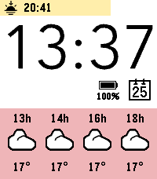
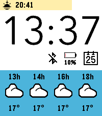

# HassWeather Pebble

C rewrite of [hassweather](https://github.com/vincentezw/hassweather-pebble)

A clockface that shows a brief forecast and sunrise and sunset hours. What makes it unique, is that these are fetched from your own Home Assistant instance. This allows you easy acess to many weather providers with the API burden placed with Home Assistant.

The watchface also displays an indicator of your "progress" from the last sunrise/sunset to the upcoming sunrise/sunset.

## Attribution
* Weather icons are sourced from [here](https://github.com/D0-0K/Pebble-Icons).
* Some graphics are sourced from [Timestyle](https://github.com/freakified/TimeStylePebble).

## BDS

This project endorses the [Boycott, Divestment, Sanctions](https://bdsmovement.net/) movement against the apartheid state of Israel, in support of Palestinian human rights.

Support requests originating from Israel will not be addressed. Issues and pull requests from anyone, anywhere, that improve the software for everyone else, remain welcome.

## Screenshots

## TODO
- optimise layout on gabbro and legacy devices

